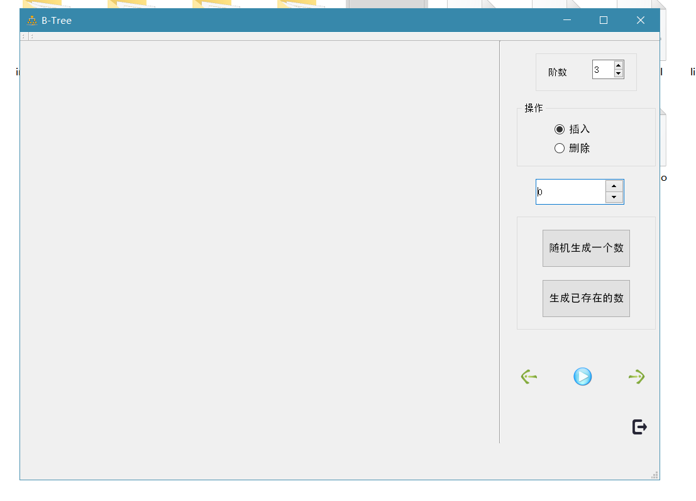
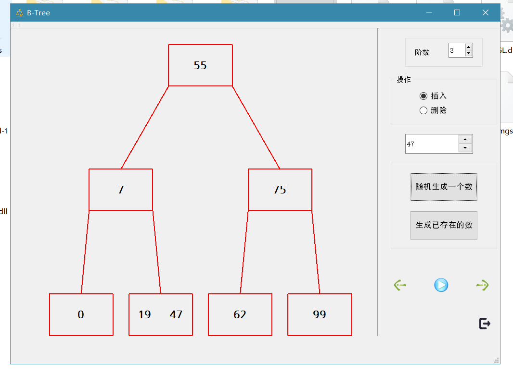
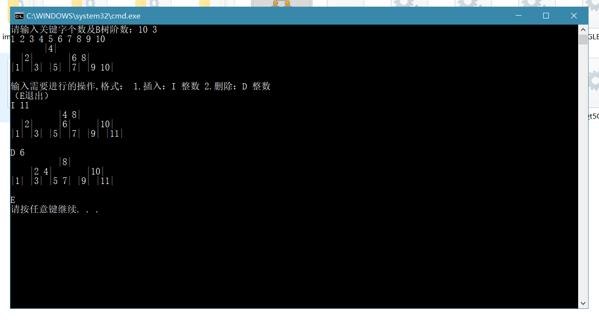

# BTree

QT实现B树可视化

> 作者: AllenOris
>
> 日期: 2018.11.17

##  文件夹内容

```
BTree
|	README.md 说明文档
|---Demo	打包好的可执行文件
|	|	BTreeDisplay.exe	可执行程序
|	|	*	一些必不可少的动态链接文件
|---imgs
|	|	*.png	一些demo图片
|---src 源代码
|	|---BTree	B树基础功能代码
|	|	|	main.cpp 主测试程序
|	|	|	BNode.h	节点类头文件
|	|	|	BTree.h	B树类头文件
|	|	|	BNode.cpp	节点类源文件
|	|	|	BTree.cpp	B树类源文件
|	|---BTreeDisplay	QT工程代码
|	|	|	mainwindow.h	主对话框头文件
|	|	|	mainwindow.cpp	主对话框源文件
|	|	|	*	其它与BTree文件下同
```

## 程序说明

本例在实现基础功能的基础上，用QT做了B树的可视化：

1. "/src/BTree"文件中的是原始代码，可以通过控制台对B树操作，并在控制台中可视化；
2. "/src/BTreeDisplay"文件中是QT可视化工程代码。用对话框和QT绘制实现B树的可视化

### 如何运行？

1.QT工程已Release，并添加了各链接库，可以直接打开"/Demo/BTreeDisplay.exe"


打开后如下图所示，



在右侧，可以选择B树阶数，单选插入或删除操作，输入的数据

点击右下方的蓝色执行按钮，即可展示



右侧两个按钮，

* "随机生成一个数"：随机生成一个0~99的整数，放入数据框中，可以进行快速插入；

* "生成已存在的数"：生成一个当前树中已存在的整数，放入数据框中，可以进行快速删除

下侧的两个箭头，

* 左箭头：撤回，查看前一个操作的树型
* 右箭头：恢复，回到后一个操作的树型

右下角的黑色图标，表示退出程序


2.另外的运行方式，也可对"/src/BTree"下的工程文件进行编译，用控制台展示



### 代码说明

B树是一个高效的数据结构，对于数据的查找、插入、删除，都有良好的效率

其中B树的阶数K是一个尤为重要的参数，它代表每个节点最多的子节点数量，而键值数量即为子节点数量-1

对于所有非根节点，其键值最多为(K-1)个，最少为floor((K-1)/2)个

* 节点类BNode

```c++
template <class T>
class BNode
{
public:
	list <T> keys;	//键值表
	list <BNode<T>*> child;	//子节点指针表
	BNode<T>* fa;	//父节点指针

	BNode();
	BNode(T);
	~BNode();
	bool isLeaf();	//判断是否是叶节点
	bool hasKey(T key);  //判断是否存在某一键值
	bool replace(T old_key, T new_key);  //替换键值
	bool eraseKey(T key);  //删除键值
	bool eraseChild(BNode<T>*); //删除子节点指针
	void updateChild(); //子节点重定向
	void insertKey(T data, BNode<T>* child1, BNode<T>* child2);	//向节点插入某键值，并更新子节点指针
	void print();	//输出节点键值
	BNode<T>* next(T key);	//获取key应该指向子节点的方向
	T getKey(int pos);	//获取节点第pos个键值
	int size();	//获取节点所存储键值数量
};
```

本例使用链表的方式存储节点的键值组和子节点指针表，这样存储的好处是便于插入和删除，在树的插入和删除时，需要对树型结构进行平衡操作，涉及节点的分裂及合并，利用链表的易插入和已删除和高效合并的特性，可以快速进行上述操作。

* B树类BTree

```c++
template<class T>
class BTree
{
protected:
	BNode <T> *root;//根节点指针
	int k;	//B树为k阶
	int minKey, maxKey; //最少键值和最多键值
	int nsize;  //B数结构元素（键值）总数
	void maintainAfterInsert(BNode<T> *);	//插入元素后保持树形结构平衡
	void maintainAfterErase(BNode<T>*);  //删出元素后保持树形结构平衡
	void mergeNode(BNode<T>*, BNode<T>*, T, bool flag);//合并两个节点，flag为0时，表示合并左节点；否则合并右节点
	void deleteNode(BNode<T> *);	//删除节点空间，用于析构
	void print(BNode<T>*);	//输出节点
	BNode<T>* splitLeftNode(BNode<T>*, int);	//节点分裂得到左节点
	BNode<T>* splitRightNode(BNode<T>*, int);	//节点分裂得到右节点
	BNode<T>* findBrotherNode(BNode<T>*,T&,bool flag);//查找兄弟节点,flag为0时，查找左节点；否则为右节点
	BNode<T>* findNode(T);	//获取存在该键值的节点
    
public:
	BTree();
	~BTree();
	BTree(int k);	//构造，传入B树阶数
	bool insert(T data);	//插入
	bool erase(T key);  //删除
	void printRoot();	//输出根节点
	void printArray();	//输出排序结果
	void printTree();	//输出简化版树型
	void printWholeTree();	//输出完整树型
	BNode<T>* findNextNode(BNode<T>*p, T, T&);  //获取后继节点及键值
	BNode<T>* findPreNode(BNode<T>*p, T, T&);	//获取前驱节点及键值
	int size();	//获取树元素总数
	int height();	//获取树高度
	BNode<T>* getRoot();	//获取根节点指针

private:
	int getLen(int);	//辅助函数，获取数字长度
	void GetDFS(BNode<T>*p, int d, int* dep, int *tab, map<T, int>&mp, int& cnt);	//辅助函数，用于递归获取输出树型的信息
};
```

常用的面向外部的函数为下列三个：

* `bool insert(T data)`:插入数据，返回值为布尔型，表示数据是否插入成功，如果为false，说明该键值已存在
* `bool erase(T data)`:删除数据，返回值为布尔型，表示数据是否删除成功，如果为false，说明该键值在树中不存在
* `int size()`:获取树中右多少个元素（键值）个数

## 一些问题

* 模板类的问题

本例中，BTree类和BNode类均为模板类，只要可以对不同类型的键值进行B树的操作

这样也存在一个问题，我们习惯把头文件和源文件放在不同的文件，即把.h和.cpp分开写，但是对于模板类，编译器无法将模板类.cpp文件进行编译，出现找不到类函数定义的错误。

这里有两个解决办法，一个是类声明和类定义放在一起，一个是在类前加"export"关键字。但前者，对于本例来说，太麻烦；后者，VS编译器无法识别export关键字。所以本例不得不采用这种写法:

```c++
#include "BTree.h"
#include "BTree.cpp"
```

将.h和.cpp一起包含，这样的确是不规范的写法，但好在发现了模板类的问题，在以后的程序编写时，需将模板类声明和定义写在一起

* QT对话框自适应的问题

由于QT可视化插入控件后，空间位置为绝对的坐标，所以当窗口大小改变后，控件却不会改变。所以，本例中的控件坐标是相对位置，但由于一些QT内部机制的问题，只能在树型执行后才能应用，应用后也存在一些奇怪的问题。

解决方法是利用QT的布局管理器，仍需继续学习和改进。

